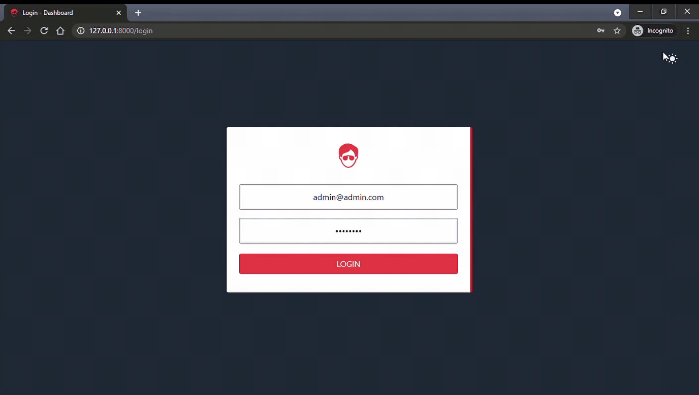

# Admin Dashboard

<a href="https://github.com/SaiHtetWaiYan/admin-dashboard/blob/main/LICENSE">
    
</a>

🧶 A application build with Laravel , Inertia.js , Vue.js and Tailwindcss  .

## Resources
- [Laravel](https://laravel.com)
- [Inertiajs](https://inertiajs.com)
- [Vue](https://vuejs.org)
- [Tailwindcss](https://tailwindcss.com)
- [Spatie](https://spatie.be/docs/laravel-permission/v4/introduction)
- [Heroicons](https://heroicons.dev)


## Demo




## Project setup

Install PHP dependencies:

```sh
composer install
```

Install NPM dependencies:

```sh
npm install
```

Build assets:

```sh
npm run dev
```

Setup configuration:

```sh
cp .env.example .env
```

Generate application key:

```sh
php artisan key:generate
```

Connect to local database

```sh
DB_DATABASE= database name
DB_USERNAME= database user name
DB_PASSWORD= database password
```

Run database migrations:

```sh
php artisan migrate
```

Run database seeder:

```sh
php artisan db:seed
```

You're ready to go! Login with:

- **Username:** admin@admin.com
- **Password:** password